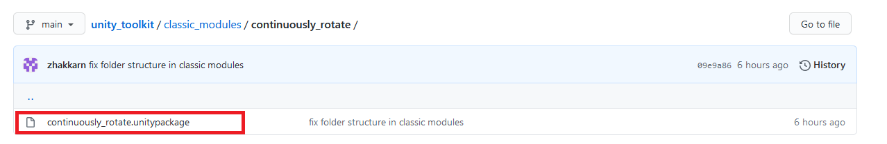

# What it is

This repo is meant to offer you ready-to-use scripts for your unity prototype. They come in two flavors, C# (a.k.a "classic") and bolt. C# is the standard way, so most tutorials are written with this and you have a greater potentiel but it is harder to learn, write and read. Bolt is a graphical/nodal way to write code it is arguably just as hard to write but way easier to read.

# How to navigate

Right above you can see the folder structure of the repo so you can deceide to browse by classic or bolt modules. 

The namming convention helps you know what they do and how to use them. We have three kind of modules :
- standalone : Their name looks like "Do X in Y way". These modules can just be sticked onto GameObjects and do their job, you'll probably have a few tweakable parameter in the inspector but that's about it. 
- emitter : Their name looks like "event_emitter_on_X" where X is the event it triggers from. In the inspector the module will take GameObjects and from a drop-down you'll be able to select which actions gets trigger when the emitter fires up.
- receiver : Their name looks like "Do X on Event" where X is the action performed when an event is received. These modules always have a function called "X"

# How to get and use one of these modules

## Example with classic modules
Use the folder structure at the top of the page to select your in this case we'll click on the "classic_modules" folder.
 
 
 

 
 
 
Here you'll find the documentation specific to these modules and a module per folder. Say I want a GameObject to continuously rotate in my scene then I'll click on the "continuously_rotate" folder.
 
 
 

 
 
 
Here you may find information on the indivdual module module but most importantly you'll find the unity package which is an importable module.
 
 
 

 
 
 
If I click on the "continuously_rotate.unitypackage" file I'll have the opiton to download it
 
 
 

 
 
 
Now that you have the module on your computer you can drag and drop it into your unity project and you'll see the content of the module.
 
 
 

 
 
 
All the classic modules will go into the "classic_modules" folder in your assets. So you'll find a "continuously_rotate" folder containing example prefab using the modules you can drop in your scene or an example scene which just need to be launched to see the minimum in action. The module is the script "ContinuouslyRotate". If you drag and drop it on a GameObject you'll be set and the GameObject will now rotate forever as soon as the scene starts.
 
 
 

 
 
 
You can click the gameObject and see the module in the inspector. Often you'll have some values to tweak what the module does. Here you can see that we rotate both on the X and Y axes at different speeds.
 
 
 

To go further, (use the emitter/receiver modules to make interactive content for example), you'll find this in the documentation of the appropriate module category.

## Example with Bolt modules
[WIP]

To go further, (use the emitter/receiver modules to make interactive content for example), you'll find this in the documentation of the appropriate module category.
