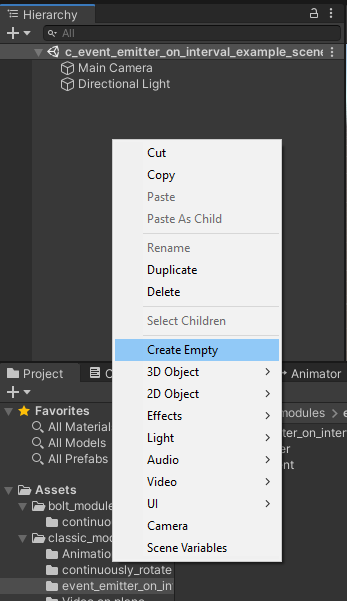
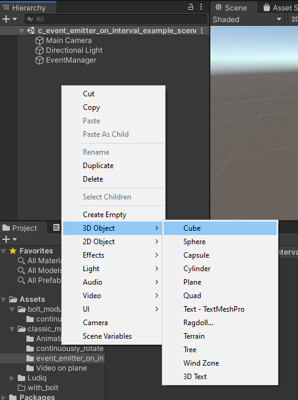
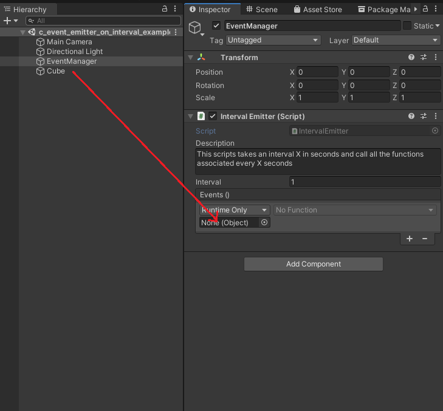

# Classic modules

## How to use events

It is advised to create an empty GameObject, to call it "Event Manager" and to put all your emitter scripts in there.
 
 
 

 
 
 
To match an emitter with a receiver
 
 
 
1.Add the "do X onEvent" script to the GameObject you want to affect. And the emitter you want to use in the EventManager if it's not already there.
 
 
 

 
 
 
2.click the "+" in the Event list of the emitter
 
 
 

 
 
 
3.drag the affected GameObject in the emitter where you can read `None (Object)`
 
 
 

 
 
 
4.in the drop down, select "do X onEvent" > "X"
 
 
 

 
 
 
Profit  
 
 
 

